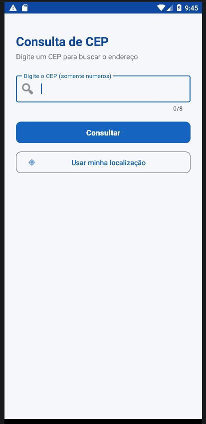
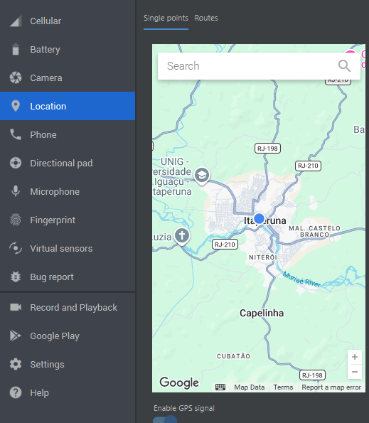
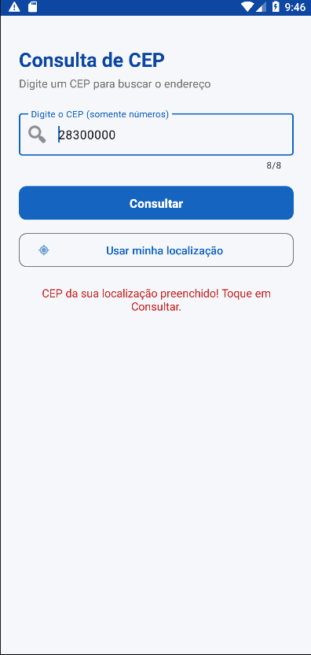
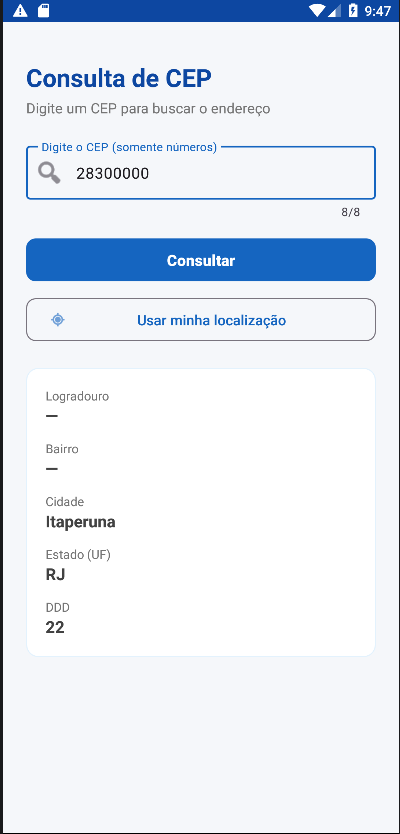
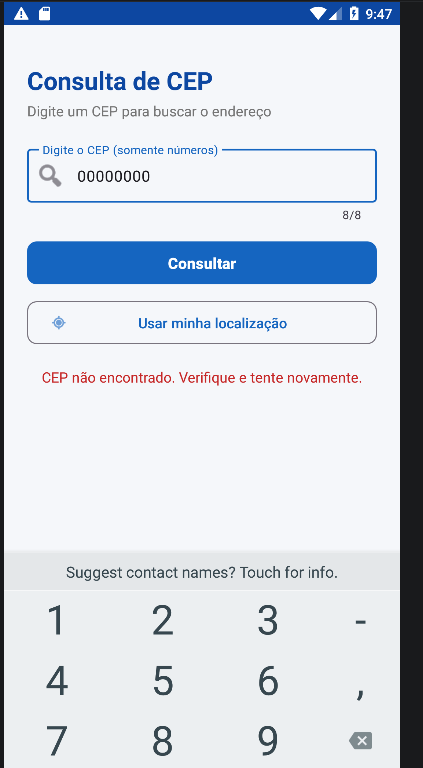

# Consulta CEP — Versão com Permissão Android

## Descrição
Aplicativo Android que consulta o endereço a partir de um CEP brasileiro usando
a API pública ViaCEP. Nesta versão, o app evolui e passa a permitir que o usuário
preencha o CEP automaticamente a partir da sua localização atual, utilizando a
permissão de localização do Android.

## Relação com a atividade anterior
Na atividade anterior, o app consultava um CEP digitado manualmente pelo usuário
e exibia o endereço (logradouro, bairro, cidade, estado e DDD) consumindo a API
ViaCEP. Nesta versão foi adicionado um botão "Usar minha localização", que
obtém as coordenadas do dispositivo, converte essas coordenadas em um CEP
(geocodificação reversa) e preenche o campo automaticamente. Toda a funcionalidade
original de consulta por CEP foi mantida.

## API utilizada
- Nome da API: ViaCEP (consulta de endereço) e Nominatim/OpenStreetMap (geocodificação reversa)
- Endpoint utilizado:**
- ViaCEP: `https://viacep.com.br/ws/{cep}/json/`
- Nominatim: `https://nominatim.openstreetmap.org/reverse?lat={lat}&lon={lon}&format=json&addressdetails=1`
- Dados exibidos no app: logradouro, bairro, cidade (localidade), estado (UF) e DDD.

## Permissão Android utilizada
- Permissão escolhida: `ACCESS_FINE_LOCATION` (localização precisa)
- Onde ela foi declarada no Manifest: no arquivo `AndroidManifest.xml`, junto à permissão INTERNET.
- Por que essa permissão é necessária para o app: para que o app possa obter
  as coordenadas atuais do usuário e, a partir delas, descobrir e preencher o CEP
  automaticamente, sem que o usuário precise digitá-lo.
- Em qual momento do fluxo ela é solicitada ao usuário: quando o usuário toca
  no botão "Usar minha localização" pela primeira vez. Se a permissão ainda não
  tiver sido concedida, o app exibe uma explicação e abre o diálogo de permissão.

Exemplo:
```xml
<uses-permission android:name="android.permission.ACCESS_FINE_LOCATION" />
```

## Fluxo da permissão
Explicação do que acontece quando:
1. A permissão já foi concedida: o app obtém a localização atual diretamente,
   converte em CEP e preenche o campo, exibindo uma mensagem de sucesso.
2. O usuário concede a permissão: o diálogo do Android é aceito, o app segue o
   fluxo e obtém a localização normalmente.
3. O usuário nega a permissão: o app exibe uma mensagem explicativa informando
   que ainda é possível digitar o CEP manualmente, e continua funcionando sem quebrar.

## Funcionalidades
- Consumo de API pública (ViaCEP)
- Validação de entrada (campo vazio e formato de 8 dígitos)
- Funcionalidade com permissão Android (localização)
- Tratamento de permissão concedida
- Tratamento de permissão negada
- Exibição de feedback ao usuário (mensagens e indicador de carregamento)

## Tecnologias utilizadas
- Kotlin
- Android Studio
- XML (layout)
- Volley (biblioteca de requisição HTTP)
- Google Play Services Location (FusedLocationProvider)
- Permissão Android: ACCESS_FINE_LOCATION

## Como executar o projeto
1. Clonar este repositório.
2. Abrir o projeto no Android Studio.
3. Aguardar a sincronização do Gradle.
4. Executar em emulador ou dispositivo físico.
5. Testar a funcionalidade de API digitando um CEP (ex.: `28300000`) e tocando em Consultar.
7. Testar a funcionalidade que solicita permissão tocando em Usar minha localização. Após permitir o uso da localização
vá em Exentended Controls (três pontos), Location, escolha o seu local e clique em Set Location


## Prints do aplicativo








## Autor
Lucas Gonçalves Pompilho - 2569056
